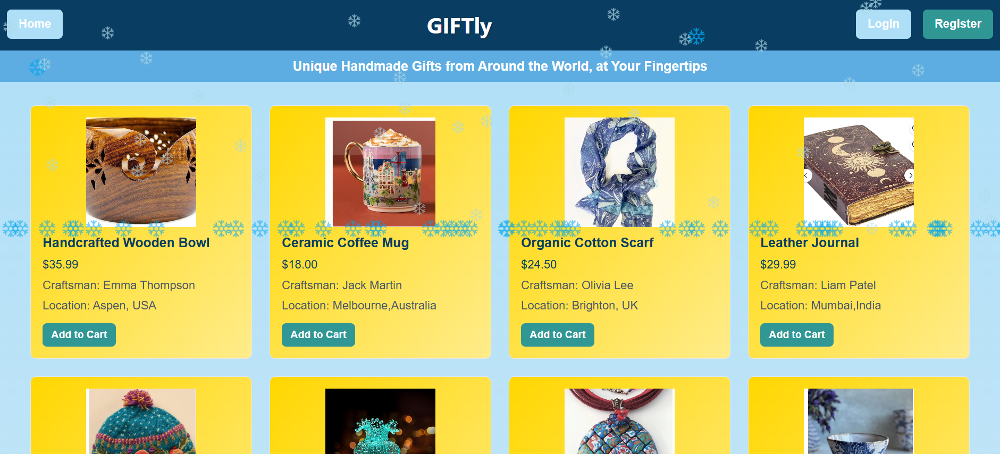
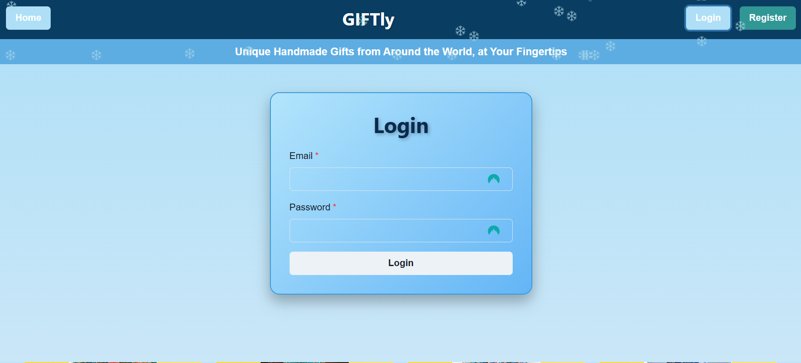
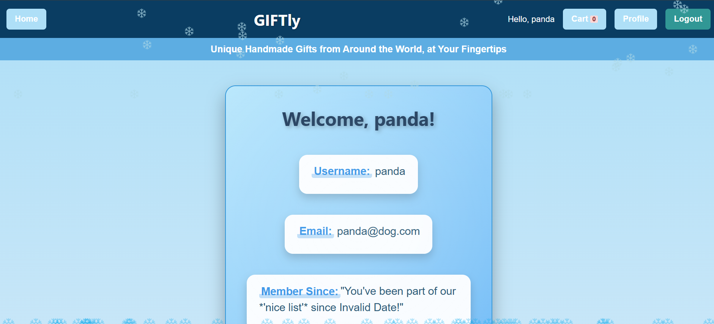
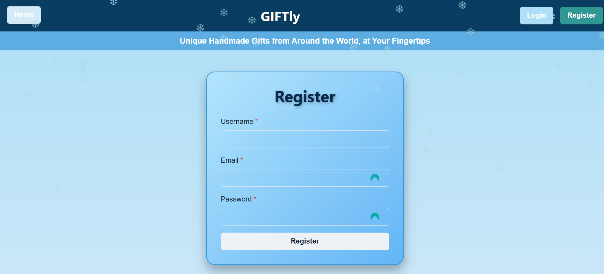
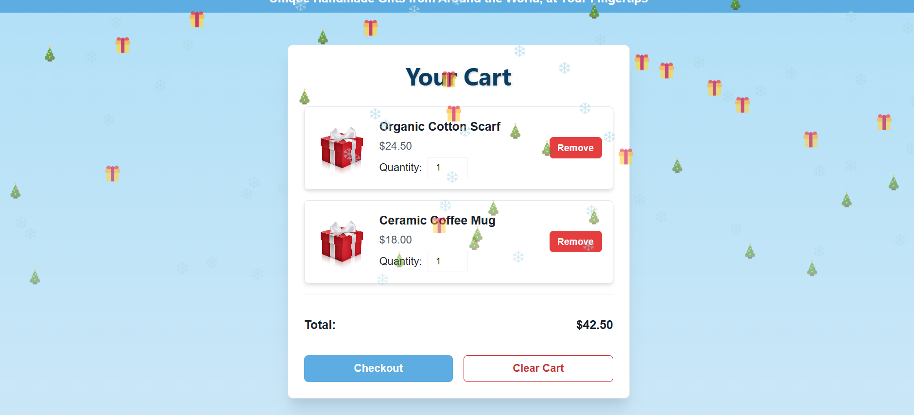

# GIFTly
# Gift Finder App README

## Overview
GIFTly is a web application designed to simplify gift shopping by helping users discover, organize, and manage gift ideas. The app offers an intuitive interface where users can browse gifts, manage their accounts, add gifts to their collection, and view details about each gift. Key pages include the home page, user page, collection/cart page, and gift detail.

## Table of Contents
1. [Home Page](#home-page)
2. [User Page](#user-page)
3. [Collection/Cart Page](#collectioncart-page)
4. [Content](#content)
5. [Installation](#installation)
6. [Images](#images)
7. [Questions](#Questions)
8. [Deployed-App](#Deployed-Application)

## Home Page
### Purpose
The main landing page, giving users access to their current gift collection and cart.

### Content
Current Collection: Displays gifts the user has saved.
Cart Preview: Shows a summary of items in the cart.

## User Page
### Purpose
Consolidates user login, settings, and account management into a single interface.

### Content
- **Login Form:** Displays when the user is not logged in.
- **Profile Settings:** Includes options for updating user information.
- **Logout Option:** Available when the user is logged in.

### Features
- Conditional rendering of the login form or user settings based on login status.

---

## Collection/Cart Page
### Purpose
Combines saved gifts and cart functionality into one organized page.

### Content
- **Saved Gifts:** Displayed at the top of the page.
- **Cart Items:** Shown at the bottom, separated by a divider.

### Features
- Ability to move items between the collection and the cart.
- Manage cart items (update quantities, remove items).
- Initiate checkout directly from this page.

## Installation
To set up the Gift Finder app locally, follow these steps:

1. Clone the repository:
 git clone <https://github.com/erinspix/GIFTly.git>
cd giftly

npm install
npm start

The server will run at http://localhost:3001.

Verify the Application:
Open a browser and visit http://localhost:3001 to ensure everything works correctly, including login, collection management, and cart functions.

## Images

## Questions

For any questions, please contact me with the information below:

GitHub: [erin spix](https://github.com/erinspix)  
Email: e.spix@yahoo.com

GitHub: [kalen james](https://github.com/Ksjames22)  
Email: Ksjames@radford.edu

GitHub: [emily myhand](https://github.com/emangelic)  
Email: ema.angelic@outlook.com

GitHub: [lily ebadi](https://github.com/EbLily)  
Email: lilly888_ebadi@yahoo.com

## Deployed Application
You can find the live version of the app here: 
[GIFTly](https://giftly-yg35.onrender.com)